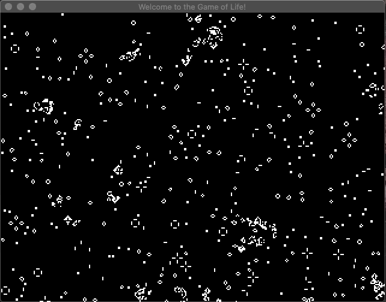
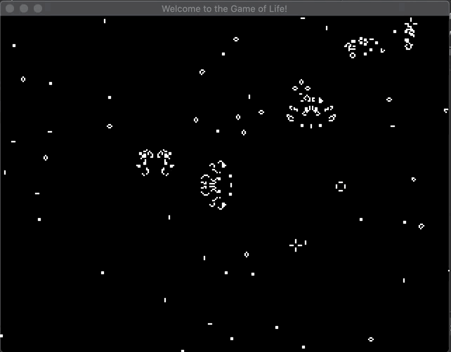
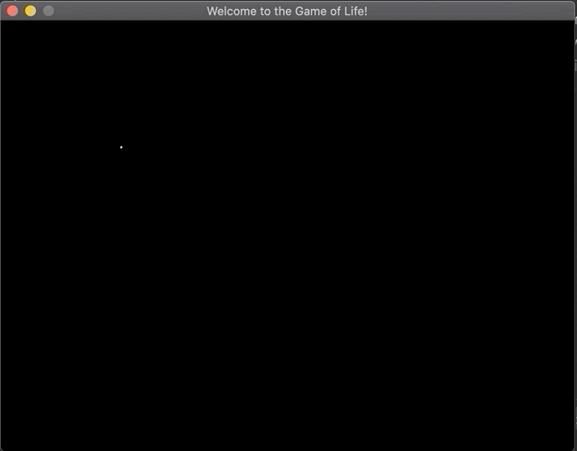

# Game of Life

This is a Golang implementation of [conway's game of life](https://en.wikipedia.org/wiki/Conway%27s_Game_of_Life)

This is my first real Golang program, I chose conway's game of life as a method of learning/getting familar with golang.

The [Ebiten](https://github.com/hajimehoshi/ebiten) game library, a simple 2D game library was used for the visualisation componenet of the project, somewhat similar to [Pygame](https://www.pygame.org/wiki/GettingStarted) for those coming from a python background.

To me, the most beautiful thing about conway's game of life, is how global complex patterns can emerge from such simple local rules a phenomena often termed [Emergence](https://en.wikipedia.org/wiki/Emergence).

## Usage

This program has two modes a standard mode and an interactive mode

## Standard mode

The standard mode is the default and it can be run by executing the main.go file:
In this mode, the first generation of cells are randomly created. A less densely populated board can be created by modifying the density via a command line flag (lower number is more dense, default value is 10).

```
go run main.go
```



```
go run main.go --density 25
```



## Interactive mode

In the interactive mode, the user can draw the starting state of the cells using their mouse by **left-clicking**. Once the desired pattern of cells has been drawn a **right-click** will trigger the simulation. Pressing the **middle-mouse-button** will stop the currently running simulation, clear the board of all cells and return the user to a state where they can draw a fresh starting state.

```
go run main.go --interactive
```


